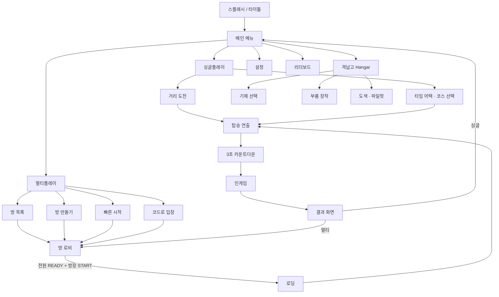

# 09. UI/UX 플로우

## 9.1 전체 화면 전이도



## 9.2 방 로비 화면 — 원 요구사항의 핵심 화면

```
┌──────────────────────────────────────────────────────────────────┐
│  ◀ 나가기        방 이름: 초보만 오세요        코드: 4K7X2P  [🔒] │
├───────────────────────────────┬──────────────────────────────────┤
│                               │  게임 모드                    🔓 │
│   [ 맵 프리뷰 이미지 ]         │  ┌────────┬────────┐            │
│      협곡 회랑                 │  │ 스피드  │  전투  │            │
│      길이 14.2km · POI 4       │  └────────┴────────┘            │
│                               │  ┌────────┬────────┐            │
│                               │  │ 개인전  │  팀전  │            │
│                               │  └────────┴────────┘            │
│                               │  팀 수: [ 2 ▾ ]  [자동 균등 배분]│
├───────────────────────────────┴──────────────────────────────────┤
│  RED 팀                          │  BLUE 팀                      │
│  👑 민규   Falcon   32ms  ✅준비   │  🙍 Kim    Dart    48ms  ⬜대기│
│  🙍 Lee    Bastion  55ms  ✅준비   │  🙍 Park   Whisper 91ms  ✅준비│
│  ＋ 빈 자리                       │  ＋ 빈 자리                    │
├──────────────────────────────────────────────────────────────────┤
│  [기체 변경]              [ 준 비 ]          [ 게임 시작 ] (방장) │
└──────────────────────────────────────────────────────────────────┘
```

### 잠금 상태의 시각 표현
| 상태 | 모드/맵 버튼 | 헤더 아이콘 | 안내 |
|---|---|---|---|
| `OPEN` | 활성 (방장만) | 🔓 | — |
| `LOCKED` | **비활성 + 회색 처리 + 커서 금지** | 🔒 | 툴팁: "전원 준비 완료 — 설정을 변경하려면 준비를 해제하세요" |
| `STARTING` | 전부 비활성 | ⏱ | "5초 후 시작… [취소]" |

- 비방장에게는 모드/맵 UI가 **읽기 전용**으로 항상 표시됩니다 (숨기지 않음 — 무엇으로 플레이하는지 알아야 준비를 누를 수 있음).

## 9.3 토스트 알림 시스템

### 사양
| 항목 | 값 |
|---|---|
| 위치 | 화면 상단 중앙 (로비/인게임 공통) |
| 크기 | 폭 420px, 높이 가변 (1~2줄) |
| 지속 | 3.5초 (중요 알림 5초) |
| 애니메이션 | 위에서 슬라이드 인 0.25s → 유지 → 페이드 아웃 0.4s |
| 스택 | 최대 3개, 아래로 쌓임. 초과 시 가장 오래된 것 즉시 제거 |
| 중복 | 같은 유형(type) 재발생 시 **새로 쌓지 않고 기존 것을 갱신 + 타이머 리셋** |
| 사운드 | 유형별 짧은 SFX (설정에서 OFF 가능) |

### 토스트 유형표

| 유형 | 색 | 아이콘 | 문안 예시 |
|---|---|---|---|
| `MODE_CHANGED` | 주황 | 🎮 | **게임 모드 변경**<br>전투(팀전) → 스피드(개인전)<br>_준비 상태가 해제되었습니다_ |
| `MAP_CHANGED` | 주황 | 🗺 | **맵 변경**<br>협곡 회랑 → 화산 지대<br>_준비 상태가 해제되었습니다_ |
| `TEAM_CHANGED` | 주황 | 👥 | **팀 구성 변경** 2팀 → 3팀 |
| `PLAYER_JOIN` | 청색 | ➕ | Kim 님이 입장했습니다 |
| `PLAYER_LEAVE` | 회색 | ➖ | Park 님이 퇴장했습니다 |
| `HOST_CHANGED` | 보라 | 👑 | 민규 님이 새 방장이 되었습니다 |
| `READY_REJECTED` | 적색 | ⚠ | 설정이 변경되어 준비가 취소되었습니다 |
| `KICKED` | 적색 | 🚫 | 방장에 의해 퇴장되었습니다 |
| `PING_RECEIVED` | 팀컬러 | 📍 | Lee 님이 지점을 공유했습니다 |
| `POI_NEARBY` | 녹색 | 🔧 | 정비소 1.2km 전방 (고도 +1,400m) |

> **원 요구사항 이행 확인**: *"모드 또는 맵이 변경되면 플레이어들에게 토스트로 변경사항을 알림"* → `MODE_CHANGED` / `MAP_CHANGED` 유형이 **변경 전 → 변경 후를 모두 표기**합니다. 무엇으로 바뀌었는지만이 아니라 무엇에서 바뀌었는지를 보여줘야 유저가 상황을 이해합니다.

## 9.4 인게임 HUD

```
┌──────────────────────────────────────────────────────────────────┐
│ ⛰ 6,240m                     [ 목적지 8.4km ]      💀 킬 피드    │
│ ────────────                   ▼ 다음 체크포인트     민규 →🚀 Kim │
│                                                                  │
│                          ┌─────────┐                             │
│                          │   ✛     │  ← 조준점 (락온 시 확장)     │
│                          └─────────┘                             │
│                                                                  │
│                       [ 인공수평선 · 롤 인디케이터 ]              │
│                                                                  │
│ ┌───────────┐                                    ┌─────────────┐ │
│ │  미니맵    │  HP ████████░░ 78                 │ 1위 민규     │ │
│ │  (원형)    │  BOOST ██████░░░░                 │ 2위 Kim  -2s │ │
│ │      고 │  │  ┌────┬────┬────┬────┐           │ 3위 Lee  -6s │ │
│ │      도 │  │  │ 🔫 │ 🚀3│ ✨1│ ⚡ │ ← 슬롯    │ 4위 Park -9s │ │
│ └───────────┘  └────┴────┴────┴────┘           └─────────────┘ │
│                     ▲ 선택됨 (Q로 순환)      속도 21,400 u/s     │
└──────────────────────────────────────────────────────────────────┘
```

### HUD 요소 우선순위
| 항목 | 상시 | 상황부 |
|---|---|---|
| 미니맵(좌하단) | ✅ | |
| HP / 부스트 | ✅ | |
| 아이템 슬롯 | ✅ | |
| 속도 / 고도 | ✅ | |
| 조준점 | ✅ | 락온 시 형태 변화 |
| 인공수평선 | ✅ | 옵션으로 OFF 가능 |
| 순위표 | 멀티만 | |
| 킬 피드 | 멀티만 | |
| 거리/기록 | 싱글만 | |
| 피격 방향 지시 | | 피격 시 1.5초 |
| 후방 경고 (레이스 1위) | | 추격자 500m 내 |
| 공역 이탈 경고 | | 서든데스 |
| POI 근접 안내 | | 1.5km 내 |

**설계 원칙**: 화면 중앙 60%는 **항상 비워 둡니다.** 비행 게임에서 HUD가 시야를 가리면 장애물 회피가 불가능해지고, 이는 곧 "조작이 구리다"는 리뷰로 돌아옵니다.

## 9.5 전체 지도 화면
[05번 문서 5.4](05_map_poi_minimap.md) 참조. 요약:
- `Tab` 홀드 중 표시, 게임은 계속 진행, Auto-level 보조 활성
- 중앙 30% 반투명 유지로 전방 시야 확보
- `RMB` 핑, `LMB` 비활성

## 9.6 결과 화면

```
┌────────────────────────────────────────────────┐
│              🏆  1 위                           │
│           협곡 회랑 · 스피드(팀전)               │
│  ┌──────────────────────────────────────────┐ │
│  │ RED 팀  28점   ← 승리                     │ │
│  │  민규  1위  4:12.35  격추2  POI3          │ │
│  │  Lee   3위  4:31.02  격추0  POI2          │ │
│  │ BLUE 팀 19점                              │ │
│  │  Kim   2위  4:20.88  격추1  POI4          │ │
│  └──────────────────────────────────────────┘ │
│  획득: +250 XP   +120 Sky Coin                 │
│  [██████████░░░] Lv.12 → Lv.13 까지 340 XP    │
│                                                │
│  [ 다시 하기 ]  [ 로비로 ]  [ 리플레이 저장 ]  │
│                        15초 후 자동 로비 이동   │
└────────────────────────────────────────────────┘
```

## 9.7 튜토리얼 & 온보딩 (매우 중요)

비행 게임 이탈의 80%는 **첫 3분**에 발생합니다. 별도 튜토리얼 스테이지를 만들지 않고 **첫 싱글 플레이에 내장**합니다.

| 시점 | 학습 내용 | 방식 |
|---|---|---|
| 0:00 | 이륙 (W) | 카운트다운 후 화면 중앙 키 프롬프트 |
| 0:15 | 기울기 (A/D) | 완만한 커브 구간 자연 유도 |
| 0:40 | 벡터 기동 (Space + 방향) | 링 게이트를 위쪽에 배치 → 올라가야만 통과 |
| 1:10 | 부스트 (Ctrl) | 직선 구간 + "지금!" 프롬프트 |
| 1:40 | 사격 (LMB) | 느린 표적 드론 등장 |
| 2:10 | 아이템 (Q + LMB) | 아이템 박스 강제 통과 배치 |
| 2:40 | POI 이용 | 정비소가 정면에 크게 보이도록 배치 |
| 3:10 | 지도/핑 (Tab / RMB) | 목적지가 지도에서만 확인 가능하게 |

- **모든 프롬프트는 스킵 가능**, 재확인은 설정 > 조작법.
- 첫 실행 시 "조작 연습(활주로 자유 비행)" 진입 여부를 묻고, 거절해도 위 인게임 튜토리얼은 작동합니다.

## 9.8 UI 기술 요구사항

| 항목 | 요구 |
|---|---|
| 해상도 | 1280×720 ~ 3840×2160, 16:9 / 21:9 / 16:10 대응 |
| Steam Deck | 1280×800에서 모든 텍스트 가독 (최소 폰트 20px 상당) |
| 현지화 | 한/영/중(간)/일. **문자열 하드코딩 금지**, 전량 테이블화 |
| 텍스트 확장 | 독일어/러시아어 추후 대응 위해 버튼 폭 30% 여유 |
| 폰트 | Noto Sans CJK (라이선스 무료, 4개 언어 커버) |
| 입력 표시 | 키보드/게임패드 자동 감지하여 아이콘 전환 |
