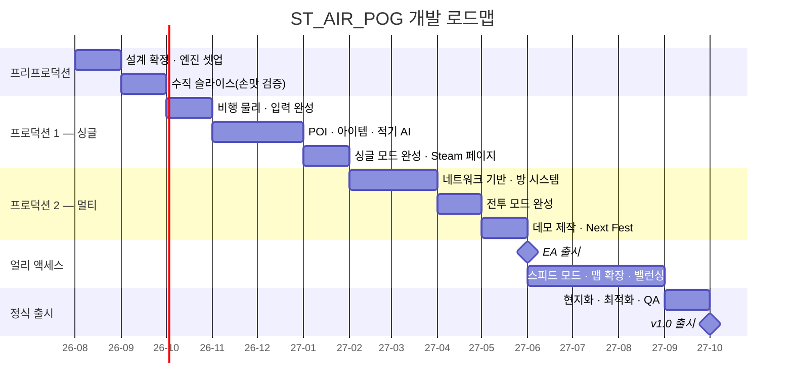

# 13. 로드맵 & 마일스톤

## 13.1 전체 일정 (14개월 + EA 운영)

## 13.2 마일스톤 정의 및 통과 기준(Gate)

각 마일스톤은 **통과 기준을 만족하지 못하면 다음 단계로 넘어가지 않습니다.** 특히 M1은 프로젝트 존속 여부를 결정하는 관문입니다.

---

### **M0 — 설계 확정** (1개월)
- [ ] [14번 문서](14_open_questions.md)의 D-01 ~ D-08 전부 결정
- [ ] 엔진 확정 및 프로젝트 셋업, Git LFS, CI 파이프라인
- [ ] 데이터 테이블 스키마 확정
- **통과 기준**: 설계 문서에 "미정"이 남아 있지 않음

---

### **M1 — 수직 슬라이스 (VERTICAL SLICE)** 🔴 **최중요** (1.5개월)

> **활주로 이륙 → 협곡 비행 → POI 1곳(정비소) → 결승선.** 싱글 전용, 프로그래머 아트 허용.

- [ ] 비행 물리 + [03번 문서](03_controls_input_spec.md) 입력 체계 (Space 모디파이어, 부스트, 스톨)
- [ ] 3레이어 고도 구조가 실제로 존재하는 코스 1개
- [ ] POI 도킹 링 + 상점 UI 1종
- [ ] 미니맵 + 고도 표기
- [ ] 기총 + 아이템 2종

**통과 기준 (외부 검증)**
- 게임을 처음 보는 사람 **8명 이상**에게 플레이시킬 것
- [ ] 조작 설명 없이 **90초 안에** 이륙하고 첫 커브를 통과하는가?
- [ ] "한 판 더 하고 싶다"고 말하는 비율이 **60% 이상**인가?
- [ ] 평균 플레이 시간이 **8분 이상**인가?
- [ ] "POI에 들를지 말지 고민됐다"는 반응이 나오는가? ← **핵심 설계 가설의 검증**

> ⚠️ **이 기준을 통과하지 못하면 프로젝트를 재설계하거나 중단해야 합니다.**
> 비행 게임의 성패는 100% 손맛에서 갈리며, 손맛은 콘텐츠를 더 넣는다고 좋아지지 않습니다.
> 여기서 멈추면 손실은 2.5개월이지만, 여기를 무시하고 진행하면 손실은 14개월입니다.

---

### **M2 — 싱글플레이 완성** (4.5개월)
- [ ] 프로시저럴 무한 생성 (시드 기반, 난이도 스케일링)
- [ ] 적기 AI 3티어 + 회피/추격 행동
- [ ] 아이템 12종 전부
- [ ] POI 3종 전부 + 세션 크레딧 경제
- [ ] 기체 4종 (나머지 4종은 M4에서)
- [ ] Steam Leaderboards + 도전과제 절반
- [ ] 인게임 튜토리얼
- **통과 기준**: 싱글만으로 **평균 세션 25분, 재플레이 3회 이상**. 즉 *"멀티가 없어도 팔 수 있는 게임"*

---

### **M3 — 멀티플레이 기반 + 전투 모드** (3.5개월)
- [ ] Steam Lobby / SDR 연동, 방 목록·입장·초대
- [ ] 방 시스템 전체 ([04번 4.6](04_game_modes.md), [08번 8.4](08_multiplayer_architecture.md))
  - [ ] 전원 준비 시 설정 잠금 + 서버 검증
  - [ ] 모드/맵 변경 토스트 + 준비 자동 해제
  - [ ] `settingsVersion` 경합 처리
- [ ] 클라이언트 예측/화해, 랙 보상
- [ ] 전투 개인전 + 팀전, 서든데스 공역 수축
- [ ] 전투 맵 2개
- [ ] 채우기 봇
- **통과 기준**: 200ms/2% 패킷 손실 환경에서 10인 경기가 **끊김 없이 완주**

---

### **M4 — 데모 & Next Fest** (1개월)
- [ ] 데모 빌드 (싱글 5km 제한 + 전투 1맵)
- [ ] 트레일러 (60~90초)
- [ ] Steam 페이지 완성, 4개 언어 스토어 텍스트
- **통과 기준**: Next Fest 종료 시 위시리스트 **20,000 이상**
  - 미달 시 → EA 진입 연기, 마케팅·데모 개선에 2개월 추가 투입

---

### **M5 — 얼리 액세스 출시** (3개월 운영)
- [ ] 스피드 모드 (개인전/팀전) 완성
- [ ] 레이스 맵 4개
- [ ] 기체 8종 전부, 부품 6종
- [ ] 6주 주기 업데이트 2회
- **통과 기준**: EA 리뷰 **긍정률 80% 이상** 유지

---

### **M6 — 정식 출시 v1.0** (1.5개월)
- [ ] 현지화 4개 언어 완전 적용 + LQA
- [ ] 최소 사양 60fps 달성, Steam Deck 검증
- [ ] 도전과제 32개
- [ ] 심각도 High 이상 버그 0
- [ ] [10번 문서 10.7](10_tech_stack.md) 릴리스 체크리스트 전항 통과

## 13.3 인력 계획

### 최소 구성 (1인 + 외주) — 14개월
| 역할 | 담당 |
|---|---|
| 기획·프로그래밍·레벨디자인 | 본인 (풀타임) |
| 3D 모델링 (기체 8 + 적기 3) | 외주 ₩1,200만 |
| UI 아이콘·일러스트 | 외주 ₩150만 |
| 음악·사운드 | 외주/라이선스 ₩400만 |
| QA | 커뮤니티 테스터(무상 키) + 지인 |

> 1인 개발로 14개월은 **매우 공격적인 일정**입니다. 현실적으로는 18~20개월을 예상하고, 지연 시 **맵 수와 기체 수를 먼저 줄이는 것**(모드는 줄이지 않음)이 정답입니다.

### 권장 구성 (3인) — 11개월
| 역할 | 인원 |
|---|---|
| 게임플레이 프로그래머 (비행·전투) | 1 |
| 네트워크 + 툴 프로그래머 | 1 |
| 테크니컬 아티스트 / 레벨 디자이너 | 1 |
| 외주 | 모델링·사운드 |

**네트워크 담당을 분리하는 것이 3인 구성의 핵심 이점**입니다. 멀티플레이 버그는 재현이 어렵고 디버깅에 시간이 무한정 소모되며, 이 항목이 인디 멀티 게임 일정 지연의 최대 원인입니다.

## 13.4 리스크 등록부

| ID | 리스크 | 확률 | 영향 | 대응 |
|---|---|---|---|---|
| R1 | **비행 손맛이 안 나옴** | 중 | **치명** | M1 게이트에서 조기 검증. 실패 시 중단 |
| R2 | **멀티 동접 0** | **높음** | 큼 | 싱글 우선 개발(M2), 채우기 봇, 리슨 서버로 고정비 0 |
| R3 | 네트워크 동기화 버그 장기화 | 높음 | 큼 | 관성 큰 기체는 예측 유리. 초기부터 저품질망 테스트 자동화 |
| R4 | 위시리스트 미달 | 중 | 큼 | D-12부터 페이지 오픈, Next Fest 타이밍 신중 |
| R5 | 일정 초과 (1인 개발) | **높음** | 중 | 맵·기체 수 축소로 흡수. 모드는 사수 |
| R6 | 성능 미달 (구름 + 10인) | 중 | 중 | Lumen 미사용, 구름 품질 스케일링 |
| R7 | 모션 시크니스 부정 리뷰 | 중 | 중 | 카메라/FOV/속도선 개별 옵션 필수 |
| R8 | 외주 품질·납기 문제 | 중 | 중 | 기체 1종 선발주로 검증 후 잔여 발주 |
| R9 | 국내 등급 분류 이슈 | 낮 | 중 | M4 이전에 법률 확인 완료 ([12번](12_steam_release_monetization.md)) |
| R10 | Alt+Tab 등 조작 사고 | 낮 | 중 | [03번 C-3](03_controls_input_spec.md) 대응 적용 |

## 13.5 스코프 축소 우선순위 (일정 지연 시)

지연이 발생하면 **위에서부터 순서대로** 잘라냅니다. 이 순서를 미리 정해두는 것이 프로젝트를 구합니다.

1. 콕핏 뷰 → v1.1 (기체 8종 내부 모델링 비용 제거)
2. 맵 8개 → 6개 (레이스 3 + 전투 2 + 싱글 1)
3. 기체 8종 → 6종
4. 아이템 15종 → 10종
5. 부품 시스템 → v1.1
6. 파일럿 커스터마이징 → v1.1
7. 리플레이 저장 → v1.1 (고스트는 유지)
8. 언어 4개 → 2개 (한/영), 나머지는 출시 후 추가

**절대 자르지 않는 것**: 싱글 거리 도전, 전투 모드, 방 시스템, POI 3종, 미니맵/전체지도/핑, 튜토리얼, 옵션(리바인딩·모션 시크니스).
