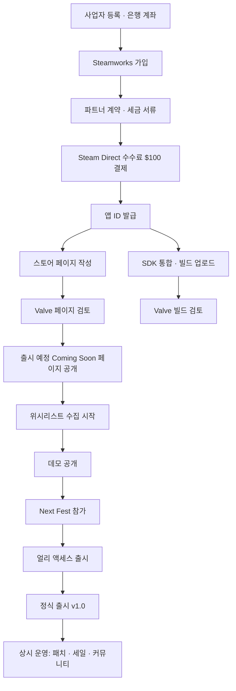

# 15. Steam 출시 절차 & 운영 실무

> [12번 문서](12_steam_release_monetization.md)가 **"얼마에 어떻게 팔 것인가(전략)"** 라면, 이 문서는 **"실제로 무슨 버튼을 어떤 순서로 누르는가(실무)"** 입니다.

> ⚠️ **정책 변동 주의**
> Steam의 수수료·대기 기간·이미지 규격·할인 규칙은 Valve가 수시로 변경합니다.
> 이 문서의 수치는 **작업 계획을 세우기 위한 기준값**이며, 실제 진행 시점에는 반드시
> **Steamworks 문서(partner.steamgames.com)** 에서 최종 확인하십시오.
> 이 문서를 근거로 법적·세무적 판단을 하지 마십시오.

---

## 15.1 전체 흐름 한눈에



**핵심 순서 원칙**: `스토어 페이지 공개`는 **게임이 완성되기 훨씬 전에** 해야 합니다. 위시리스트는 시간이 쌓여야 모이기 때문입니다. 게임을 다 만든 뒤 페이지를 여는 것이 초보 개발자의 가장 흔한 치명적 실수입니다.

---

## 15.2 Phase 0 — 사전 준비물 (D-13개월)

Steamworks 가입 **전에** 갖춰야 하는 것들입니다. 이게 없으면 가입 절차가 중간에 막힙니다.

| 준비물 | 설명 | 소요 |
|---|---|---|
| **사업자 등록증** | 개인사업자로 충분. 업종은 소프트웨어 개발/게임 소프트웨어 개발 및 공급업 | 1일 (홈택스 온라인 가능) |
| **사업용 은행 계좌** | 해외 송금 수취 가능한 계좌 | 1일 |
| **신원 확인 서류** | 신분증, 사업자등록증 사본 | — |
| **회사/스튜디오 이름** | 스토어에 퍼블리셔로 표기됨. 나중에 변경이 번거로우니 신중히 | — |
| **미국 세금 서식용 정보** | 개인사업자면 W-8BEN, 법인이면 W-8BEN-E | 세무 상담 권장 |
| **게임 제목 확정** | 상표 검색 필수 → [14 D-07](14_open_questions.md) | — |

> 💡 **세금 서식은 반드시 세무사와 상의하십시오.** 한-미 조세조약 적용 여부에 따라 원천징수 세율이 달라지고, 잘못 신고하면 매출의 상당 부분이 미국에서 원천징수됩니다. 나중에 정정하는 것보다 처음에 제대로 하는 것이 훨씬 쌉니다.

---

## 15.3 Phase 1 — Steamworks 등록 (D-12개월)

### 절차
1. **Steamworks 파트너 가입** — 기존 Steam 계정으로 신청 (게임 구매 이력이 있는 계정 권장)
2. **파트너 계약(Steam Distribution Agreement) 전자 서명**
3. **세금 인터뷰(Tax Interview)** 작성 — 온라인 문답식
4. **은행 정보 등록** → Valve가 **소액 입금으로 계좌 검증** (며칠 소요)
5. **Steam Direct 수수료 결제** — **앱당 $100**
   - 해당 게임의 누적 매출이 **$1,000**를 넘으면 환급됩니다
   - 게임마다 내는 것이지 계정당 1회가 아닙니다
6. **앱 ID 발급** — 이때부터 개발자 대시보드에서 작업 가능

### 주의할 점
- 신원·은행 검증에 **1~3주**가 걸릴 수 있습니다. 여유 있게 시작하세요.
- 수수료 결제 후 **일정 대기 기간(정책상 30일로 안내됨)** 이 지나야 출시가 가능합니다. 급하게 출시일을 잡으면 걸립니다. → **최종 확인 필요**
- 데모, 사운드트랙 DLC 등은 **별도 앱 ID**가 필요합니다(추가 수수료는 대체로 없음). 계획에 미리 넣어두세요.

---

## 15.4 Phase 2 — 스토어 페이지 (D-12개월, 최우선)

### 왜 이렇게 빨리 만드나
위시리스트는 **하루아침에 모이지 않습니다.** 개발 로그를 올리고, 트레일러를 공개하고, 커뮤니티에 노출될 때마다 조금씩 쌓입니다. 페이지가 없으면 그 관심을 **담을 그릇 자체가 없는 것**입니다.

### 필요한 에셋

| 항목 | 규격(참고) | 용도 |
|---|---|---|
| 메인 캡슐 | 1920 × 620 | 상단 배너, 특집 노출 |
| 헤더 캡슐 | 920 × 430 | 검색 결과, 위시리스트 목록 |
| 소형 캡슐 | 462 × 174 | **검색 목록. 가장 자주 노출됨** |
| 세로 캡슐 | 748 × 896 | 라이브러리, 일부 특집 |
| 페이지 배경 | 1438 × 810 | 스토어 페이지 배경 |
| 스크린샷 | 1920 × 1080, **5장 이상** | 실제 게임플레이여야 함 |
| 트레일러 | 1920 × 1080, 60~90초 | **첫 5초가 전부** |

> 규격은 변경될 수 있으니 Steamworks의 "Store Asset" 문서에서 최종 확인하십시오.

### 캡슐 이미지의 철칙
**소형 캡슐(462×174)이 실제로는 훨씬 작게 표시됩니다.** 그 크기로 축소해놓고 봤을 때
- 게임 제목이 읽히는가?
- 무슨 게임인지 3초 안에 감이 오는가?

이 두 가지가 안 되면 다시 만들어야 합니다. 캡슐 이미지는 **Steam에서 클릭률에 가장 큰 영향을 주는 단일 자산**입니다. 외주를 준다면 여기에 돈을 쓰세요.

### 페이지 작성 시 입력 항목
- 게임 설명(짧은 설명 / 상세 설명) — **짧은 설명이 검색 노출에 직결**
- 태그 (최대 20개, 상위 5개가 중요)
- 시스템 요구사항 (최소/권장) → [10 §10.3](10_tech_stack.md)
- 지원 언어 (인터페이스/음성/자막 구분)
- **콘텐츠 설문(Content Survey)** — 폭력·성적 표현·약물 등 신고. 이 게임은 대부분 "없음"으로 응답 예정 → [01 §1.5](01_product_overview.md)
- 연령 등급 정보
- 개발사/퍼블리셔 표기
- 저작권 표기

### 검토(Review)
- 페이지 제출 후 Valve가 검토합니다. 통상 **영업일 기준 며칠**.
- 반려 사유는 대체로 사소합니다(이미지 규격 오류, 설명 부적절, 저작권 표기 누락). 수정 후 재제출하면 됩니다.
- **여유를 두세요.** 출시 직전에 처음 제출하면 반려 한 번에 일정이 무너집니다.

### 공개 후
- **"출시 예정(Coming Soon)" 페이지**가 열리고 **위시리스트 버튼이 활성화**됩니다.
- 이 시점부터 [12 §12.5](12_steam_release_monetization.md)의 마케팅 계획이 작동합니다.
- ⚠️ **스토어 페이지는 출시 최소 2주 전에는 공개되어 있어야 합니다** (Valve 요구사항). 우리 계획은 12개월 전이니 문제없습니다.

---

## 15.5 Phase 3 — Steamworks SDK 통합 (M2~M3)

게임 코드에 Steam 기능을 붙이는 단계입니다. Unreal은 **Online Subsystem Steam** 플러그인으로 대부분 처리됩니다.

| 기능 | 용도 | 도입 시점 |
|---|---|---|
| **Steam 인증/로그인** | 유저 식별 | M3 |
| **도전과제(Achievements)** | 32개 → [07 §7.7](07_progression_economy.md) | M2부터 순차 |
| **리더보드(Leaderboards)** | 싱글 기록 순위 | M2 |
| **통계(Stats)** | 누적 격추 수 등 | M2 |
| **Steam Cloud** | 설정·진행도 클라우드 저장 | M2 |
| **로비/매치메이킹** | 방 목록, 입장 | M3 |
| **SDR (Datagram Relay)** | 네트워크 릴레이 → [08](08_multiplayer_architecture.md) | M3 |
| **친구 초대 / Rich Presence** | 오버레이 초대 | M3 |
| **Steam Input** | 게임패드·Deck 대응 | M4 |
| **Steam 오버레이** | Shift+Tab 지원 | 자동 |

**테스트 방법**: 개발 중에는 **비공개 브랜치**에 빌드를 올려 실제 Steam 환경에서 검증합니다. 로컬 에디터에서는 Steam 기능이 제대로 동작하지 않는 경우가 많습니다.

---

## 15.6 Phase 4 — 빌드 업로드 (SteamPipe)

### 개념
```
게임 파일 → [뎁포(Depot)에 담기] → [SteamPipe로 업로드] → [브랜치에 설정] → 유저에게 배포
```

| 용어 | 뜻 |
|---|---|
| **뎁포(Depot)** | 게임 파일이 담기는 저장 단위. 보통 "게임 본체" 뎁포 하나면 충분 |
| **빌드(Build)** | 업로드된 파일의 한 버전. 번호가 매겨짐 |
| **브랜치(Branch)** | 어느 빌드를 누구에게 보여줄지 정하는 채널 |

### 브랜치 운영 계획

| 브랜치 | 접근 | 용도 |
|---|---|---|
| `default` | 전체 공개 | 실제 유저가 받는 버전 |
| `beta` | 비밀번호 필요 | 테스터·커뮤니티 사전 검증 |
| `dev` | 비밀번호 필요 | 내부 개발 확인용 |

> **패치 배포 절차**: `dev`에 올려 확인 → `beta`에서 테스터 검증 → 문제없으면 `default`로 **빌드 전환**.
> `default`로 올리는 것은 **버튼 한 번**이고, 문제가 생기면 **이전 빌드로 되돌리는 것도 버튼 한 번**입니다. 이 롤백 가능성이 출시 직후의 가장 큰 안전장치입니다.

### 자동화
`steamcmd`를 스크립트로 감싸 **빌드 → 업로드 → 브랜치 설정**을 한 번에 실행하도록 만들어 두세요. 출시 직후 긴급 패치를 할 때 수작업이면 실수가 납니다. → [10 §10.6](10_tech_stack.md)

### 첫 빌드 검토
- 출시 전 **최소 1개의 빌드가 Valve 검토를 통과**해야 합니다.
- Valve는 게임이 실행되는지, 스토어 설명과 일치하는지 등을 확인합니다. 게임의 재미를 심사하지는 않습니다.
- 통상 **영업일 며칠** 소요. 반려되면 수정 후 재제출.

---

## 15.7 Phase 5 — 데모 · Playtest · Next Fest (M4)

### 데모
- **별도 앱 ID**로 관리하며, 본편 페이지에 "데모 다운로드" 버튼이 붙습니다.
- 데모 분량: **싱글 5km 제한 + 전투 1맵** → [13 M4](13_roadmap_milestones.md)
- 데모의 목적은 "게임을 다 보여주는 것"이 아니라 **"위시리스트를 누르게 하는 것"** 입니다. 재미가 오르막인 지점에서 끊어야 합니다.

### Steam Playtest
- 비공개 테스터를 모집해 빌드를 배포하는 기능. **멀티플레이 테스트에 매우 유용**합니다.
- 참가 신청을 받아 승인한 사람에게만 배포되므로, M3 네트워크 검증에 활용하세요.

### Next Fest
| 항목 | 내용 |
|---|---|
| 성격 | Valve가 여는 미출시 게임 데모 축제. 연 3회 내외 |
| 조건 | **미출시 게임만**, 플레이 가능한 데모 필요 |
| 횟수 | **게임당 단 1회** |
| 효과 | 위시리스트가 통상 **3~10배** 증가 |
| 신청 | 행사 수개월 전 마감. 일정 확인 필수 |

> ⚠️ **Next Fest는 재사용할 수 없는 일회용 카드입니다.** 데모가 미완성인 상태로 참가하면 그 기회는 영원히 사라집니다. 반드시 데모가 **첫 10분 안에 재미있는 상태**가 된 뒤에 쓰십시오.
> 또한 참가 기간 중에는 **매일 스트리머·커뮤니티 대응에 전념**해야 효과가 납니다. 등록만 해두고 방치하면 효과가 크게 줄어듭니다.

---

## 15.8 Phase 6 — 얼리 액세스 출시 (M5)

### 필수 준비
- [ ] EA 전용 스토어 페이지 문구 작성
  - **"왜 EA인가 / 얼마나 걸릴 예정인가 / 정식판과 무엇이 다른가 / 가격이 오를 것인가 / 커뮤니티 의견을 어떻게 반영할 것인가"** — Valve가 요구하는 5개 질문
- [ ] **가격 인상 예고를 명시** ($9.99 → $12.99). 사후 통보는 리뷰 폭탄의 확실한 원인입니다.
- [ ] 업데이트 주기 약속 (6주) — **지킬 수 있는 주기만 약속하세요.** 못 지킨 약속은 안 한 약속보다 훨씬 나쁩니다.
- [ ] 버그 신고 창구 (Steam 토론 게시판 또는 Discord)

### EA 기간 운영
| 주기 | 활동 |
|---|---|
| 매일 | 토론 게시판·리뷰 확인, 크래시 리포트 확인 |
| 매주 | 텔레메트리 확인 → 밸런스 이슈 파악 |
| 6주 | 콘텐츠 업데이트 + 패치 노트 공지 |
| 분기 | 로드맵 갱신 공지 |

---

## 15.9 Phase 7 — 정식 출시 (M6)

### D-30 ~ D-14

- [ ] **출시일 확정 및 Steamworks에 설정** (Valve 요구: **최소 2주 전** 설정)
- [ ] 최종 빌드 Valve 검토 제출
- [ ] 가격 최종 설정 (**지역별 가격** 확인 — Steam 권장값 기반으로 조정)
- [ ] 출시 할인 설정 (10%)
- [ ] 4개 언어 스토어 페이지 완성
- [ ] 스트리머·언론용 **Steam 키 발급 및 배포** (키는 무료 발급, 대량 요청 시 Valve 검토)
- [ ] 프레스킷 준비 (스크린샷, 로고, 트레일러, 사실 정보 요약)
- [ ] Steam Deck 검증 신청

### D-7 ~ D-1
- [ ] 출시 트레일러 공개
- [ ] 위시리스트 보유자 대상 사전 공지 (Steam 이벤트 기능)
- [ ] [10 §10.7](10_tech_stack.md) 릴리스 체크리스트 전항 통과 확인
- [ ] **롤백 계획 수립** — 문제 발생 시 되돌릴 이전 빌드 지정
- [ ] 출시 당일 대응 인력 확보 (최소 12시간 대기)

### D-Day
1. 예약된 시각에 **자동 출시** (수동 확인 필요 시 대시보드에서 처리)
2. **출시 즉시 게임을 직접 구매해서 다운로드** — 실제 유저와 동일한 경로로 설치·실행 확인
3. 커뮤니티 공지 게시
4. 토론 게시판·리뷰 모니터링 시작

> ⏰ **출시 시각 권장: 한국시간 기준 새벽~오전** (미국 태평양시 오전에 해당). Steam의 "신규 출시" 목록 노출과 서구권 트래픽이 겹치는 시간대입니다.

---

## 15.10 출시 직후 72시간 — 게임의 수명이 결정되는 구간

이 3일의 리뷰가 이후 1년의 판매를 좌우합니다. **개발이 아니라 대응에 전념하는 기간**입니다.

| 시점 | 할 일 |
|---|---|
| **0~6시간** | 크래시 리포트 실시간 확인. **실행 불가 버그가 있으면 즉시 롤백** |
| 6~24시간 | 첫 리뷰 확인. 반복 지적되는 문제 1~2개 파악 |
| 24~48시간 | **첫 핫픽스 배포.** 완벽하지 않아도 "빠르게 대응 중"이라는 신호가 중요 |
| 48~72시간 | 패치 노트 공지, 리뷰에 답변, 다음 패치 예고 |

### 리뷰 대응 원칙
- **부정 리뷰에 반박하지 마십시오.** 개발자의 방어적 답변은 반드시 캡처되어 확산됩니다.
- 답변은 **버그 리포트성 리뷰에만**, 사실 확인과 수정 예정 안내 위주로 짧게.
- 감정적으로 힘든 시기입니다. **답변하기 전에 하루 묵히는 것**을 규칙으로 삼으세요.
- 리뷰 삭제·수정 요구는 불가능하며 시도해서도 안 됩니다.

### 절대 하지 말아야 할 것
| 금지 | 이유 |
|---|---|
| 리뷰 조작 (지인 동원, 대가성 긍정 리뷰) | **Valve 계정 정지 사유.** 게임 생명이 끝납니다 |
| Steam 키 재판매·키 판매 사이트 유통 | 계약 위반 |
| 스토어 페이지에 허위·과장 정보 | 페이지 강제 수정 및 제재 |
| 실제와 다른 스크린샷/트레일러 | 대량 환불 + 리뷰 폭탄 |
| 출시 후 무단 가격 인상 | 신뢰 붕괴 |

---

## 15.11 상시 운영

### 정기 업무

| 주기 | 업무 |
|---|---|
| **매일** | 크래시 리포트, 토론 게시판, 리뷰 확인 (30분) |
| **매주** | 텔레메트리 분석 → 밸런스 이슈 목록 갱신 |
| **격주** | 버그 수정 패치 |
| **분기** | 콘텐츠 업데이트(맵 또는 기체 1개) + 대형 세일 참가 |
| **월** | 매출 정산 확인, 세무 처리 |

### 세일 운영
| 항목 | 내용 |
|---|---|
| 자체 할인 | Steamworks에서 직접 예약 가능 |
| 계절 세일 | 여름/겨울/가을 세일 등 — **참가 신청 필요**, 일정은 Valve가 사전 공지 |
| 할인 제약 | **할인 간 최소 간격(통상 30일)**, 출시 직후 제한, 가격 인상 직후 할인 제한 등의 규칙이 있습니다 → **진행 시점에 확인 필요** |
| 권장 리듬 | 출시 10% → 3개월 25% → 이후 33~50%를 계절 세일마다 |

> **할인은 매출 곡선을 되살리는 거의 유일한 수단**입니다. 인디 게임 매출의 상당 부분이 출시 이후 세일 기간에 발생합니다. 할인 폭을 아끼기보다 **정기적으로 노출되는 것**이 중요합니다.

### 커뮤니티 운영
- **Steam 커뮤니티 허브**: 토론 게시판 모더레이터 지정, 공지 고정(FAQ·버그 신고 양식·로드맵)
- **Steam 이벤트/공지**: 업데이트마다 반드시 게시 → 위시리스트 보유자에게 알림이 갑니다
- **Discord**: 실시간 소통과 멀티플레이 매칭에 유용. 다만 **관리 부담이 큽니다.** 1인 개발이면 Steam 게시판만으로 시작하는 것도 합리적입니다
- 언어별 대응: 최소 한국어·영어. 중국어 문의는 번역기 답변임을 밝히고 성실히 답하면 대체로 호의적으로 받아들여집니다

### 지표 모니터링
Steamworks 대시보드에서 확인할 것:

| 지표 | 보는 이유 |
|---|---|
| 판매량 / 매출 | 기본 |
| **환불률** | **5% 초과 시 경고 신호.** 기대와 실제가 다르다는 뜻 |
| 위시리스트 잔량·전환 | 남은 잠재 매출 |
| 동시 접속자(CCU) | **멀티 게임의 생존 지표** |
| 평균 플레이 시간 | 2시간 미만에 몰려 있으면 환불 구간 이탈 의심 |
| 리뷰 긍정률 추이 | 특정 패치 이후 급락하면 즉시 원인 파악 |
| 유입 경로(UTM 링크) | 어떤 마케팅이 실제로 먹혔는지 |

### 정산 및 세무
- Valve는 **월 단위로 정산**하며, 일정 기간 뒤 등록 계좌로 송금합니다 (지급 조건·주기는 계약 및 정책에 따름 → 확인 필요).
- 해외 매출이므로 **부가세 영세율 신고**, 종합소득세/법인세 처리가 필요합니다. **세무사에게 맡기는 것을 강력히 권장**합니다.
- Steam 정산 리포트를 매월 다운로드해 보관하십시오.

---

## 15.12 출시 전 최종 체크리스트

```
[ 계정 · 계약 ]
□ 사업자 등록 완료
□ Steamworks 파트너 계약 서명
□ 세금 인터뷰 완료 (세무사 검토 받음)
□ 은행 계좌 검증 완료
□ Steam Direct 수수료 결제 + 대기 기간 경과

[ 스토어 ]
□ 캡슐 이미지 5종 (소형 캡슐 축소 판독 테스트 통과)
□ 스크린샷 5장 이상, 트레일러 (첫 5초 게임플레이)
□ 4개 언어 스토어 텍스트
□ 태그 · 시스템 요구사항 · 콘텐츠 설문 입력
□ 페이지 Valve 검토 통과
□ 출시 최소 2주 전 페이지 공개 상태 유지

[ 빌드 ]
□ Valve 빌드 검토 통과
□ default / beta / dev 브랜치 구성
□ 업로드 스크립트 자동화 및 리허설 완료
□ 롤백용 이전 빌드 확보

[ 게임 ]
□ 도전과제 32개 트리거 검증
□ 최소 사양 60fps 실측
□ Steam Deck 실기 검증
□ 크래시 리포터 동작 확인
□ 전체 키 리바인딩 · 모션 시크니스 옵션
□ 4개 언어 문자열 누락 0

[ 출시 ]
□ 출시일 · 가격 · 지역별 가격 설정
□ 출시 할인 예약
□ 스트리머 키 배포 완료
□ 프레스킷 배포
□ 출시 당일 12시간 대기 인력 확보
□ 커뮤니티 공지 초안 작성 완료
```

---

## 15.13 확인이 필요한 항목 (진행 시점에 재확인)

| 항목 | 확인처 | 담당 |
|---|---|---|
| Steam Direct 수수료 및 대기 기간 | Steamworks 문서 | 본인 |
| 스토어 에셋 이미지 규격 | Steamworks 문서 | 본인 |
| 할인 간격 규칙 | Steamworks 문서 | 본인 |
| 정산 주기·최소 지급액 | 파트너 계약서 | 본인 |
| 한-미 조세조약 원천징수율 | **세무사** | 외부 |
| 국내 게임물 등급 분류 의무 | **게임물관리위원회 / 법률 자문** | 외부 |
| 게임명 상표 중복 | 특허정보넷 키프리스 | 본인 |
