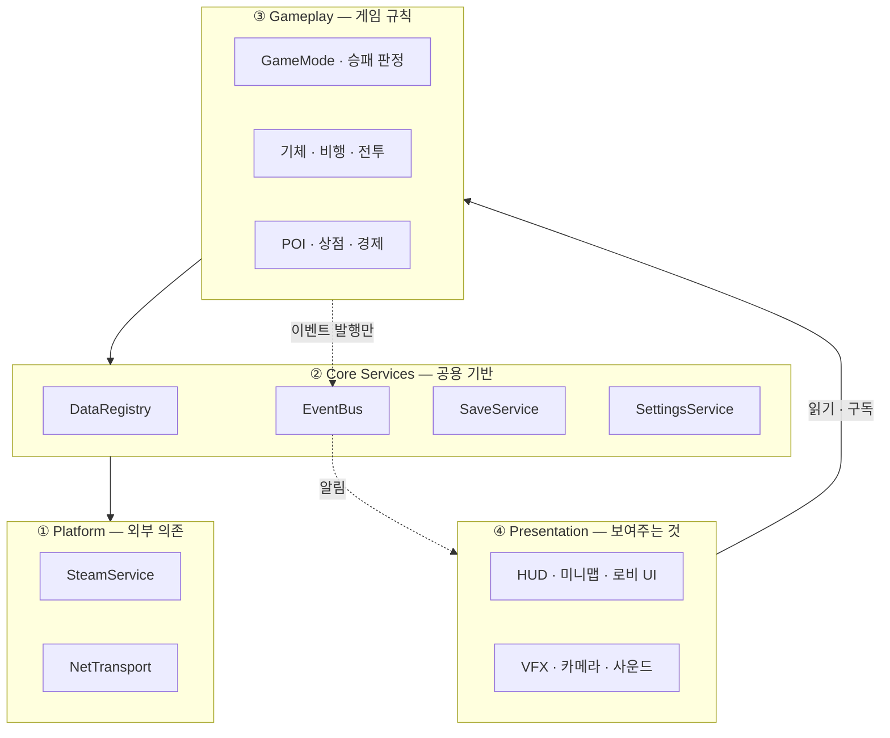
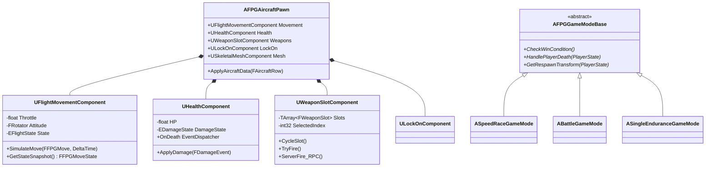
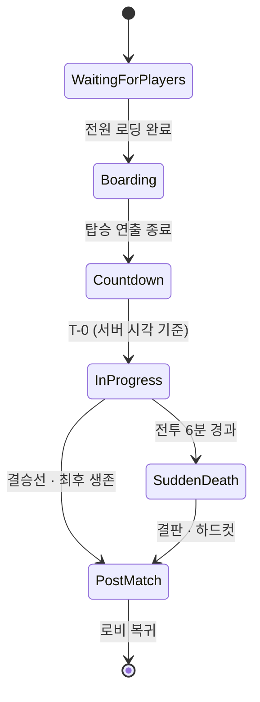
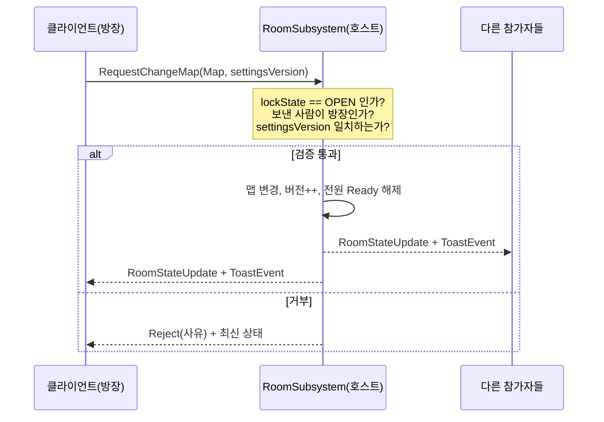

# 16. 개발 아키텍처

> [10번 문서](10_tech_stack.md)가 **"무슨 도구를 쓸 것인가"** 라면, 이 문서는 **"코드를 어떻게 나누고 조립할 것인가"** 입니다.
> Unreal Engine 5.6 기준이며, 데이터 스키마는 [17번 문서](17_data_schema.md)에 분리했습니다.

---

## 16.1 아키텍처 목표

이 게임의 구조는 아래 4가지 요구를 만족해야 합니다. 모든 설계 판단의 기준입니다.

| # | 요구 | 왜 |
|---|---|---|
| **A1** | **모드 3종이 같은 기체·무기·POI를 공유** | 모드를 추가·수정할 때 전투 코드를 건드리지 않아야 함. 그렇지 않으면 모드 하나 고칠 때마다 나머지 둘이 깨집니다 |
| **A2** | **싱글 → 멀티 전환 시 재작성 없음** | 로드맵상 싱글(M2)을 먼저 만들고 멀티(M3)를 얹습니다. 싱글을 "네트워크 없는 코드"로 짜면 M3에서 전부 다시 씁니다 |
| **A3** | **밸런스 수치는 코드 밖에** | 출시 후 수백 번 조정합니다 → [10 §10.5](10_tech_stack.md) |
| **A4** | **UI는 게임플레이를 모르고, 게임플레이는 UI를 모른다** | HUD 하나 바꿀 때 전투 코드가 재컴파일되면 개발 속도가 무너집니다 |

### 이름 규칙 — 코드명과 게임 제목의 분리

**코드는 게임 제목을 몰라야 합니다.** 제목은 마케팅 자산이라 상표 검색 결과나 시장 판단에 따라 바뀔 수 있지만, 코드 접두어가 바뀌면 전체 소스를 건드려야 합니다. 두 이름을 분리해 **제목 변경이 코드에 전혀 영향을 주지 않게** 합니다.

| 구분 | 값 | 확정 시점 | 변경 가능성 |
|---|---|---|---|
| **프로젝트 코드명** | **`FPG`** | ✅ 2026-08-02 확정 | **없음 (영구 고정)** |
| **게임 제목** | 미정 | M4(스토어 페이지 오픈) 전 | 그전까지 자유 |

| 대상 | 규칙 | 예 |
|---|---|---|
| 클래스 접두어 | **`FPG`** | `AFPGAircraftPawn`, `UFPGDataRegistry`, `FFPGMove` |
| 모듈 / 소스 폴더 | `FPGGame` | `Source/FPGGame/` |
| `/Script/` 경로 | `FPGGame` | `/Script/FPGGame.BattleGameMode` |
| 저장소 | `ST_AIR_POG` | 변경하지 않음 — 이력이 끊기고 이득이 없음 |
| 데이터 ID | 대문자 스네이크 | `AIRCRAFT_FALCON`, `ITEM_RAILGUN` |

> ⚠️ **게임 제목을 코드·에셋 경로·데이터 ID에 넣지 마십시오.** 제목은 오직 **문자열 테이블과 스토어 자산에만** 존재해야 합니다.
> 실제로 제목 후보였던 CLOUDLINE이 동명 법인 발견으로 폐기됐고([14 D-07](14_open_questions.md)), 그때 접두어가 `CLD`였다면 전체 소스를 다시 손봐야 했습니다. 이 분리가 그 비용을 0으로 만듭니다.

---

## 16.2 계층 구조



### 의존 규칙 (강제)

| 규칙 | 내용 |
|---|---|
| **R1** | 위 계층은 아래를 알아도 되지만, **아래는 위를 절대 모른다** |
| **R2** | Gameplay는 UI 클래스를 `#include` 하지 않는다. 알릴 일이 있으면 **EventBus에 발행**만 한다 |
| **R3** | UI는 Gameplay 상태를 **읽기**만 한다. 값을 바꿀 때는 PlayerController를 통한 요청(RPC)으로만 |
| **R4** | Core Services는 Gameplay 타입을 모른다 (`AAircraftPawn`을 참조하지 않는다) |
| **R5** | Platform 접근은 Service를 통해서만. Steam API를 게임플레이 코드에서 직접 호출 금지 |

> **R5가 특히 중요합니다.** Steam API를 여기저기서 직접 부르면, 나중에 콘솔 이식이나 오프라인 모드를 넣을 때 손댈 곳이 수십 군데가 됩니다. `SteamService` 한 곳만 갈아끼우면 되도록 막아둡니다.

### 모듈 분리
Unreal 모듈은 **처음에 단일 모듈(`FPGGame`)로 시작**하고, 폴더 규율로 의존 방향을 지킵니다.
컴파일 시간이 문제가 될 때(대략 소스 300개 이상) `FPGCore` / `FPGGame` / `FPGUI` 3개로 분리합니다.
1인~3인 규모에서 처음부터 모듈을 쪼개는 것은 빌드 설정 관리 비용이 이득보다 큽니다.

---

## 16.3 Unreal 게임플레이 프레임워크 매핑

Unreal이 이미 정해둔 뼈대에 우리 게임을 어떻게 얹을지입니다. **이 매핑을 어기면 네트워크가 거의 반드시 깨집니다.**

| Unreal 클래스 | 존재 위치 | 우리 구현 | 담는 것 |
|---|---|---|---|
| `GameInstance` | 클라이언트/서버 각각, **레벨 전환에도 유지** | `UFPGGameInstance` | 서비스 소유, 방 상태, 세션 |
| `GameMode` | **서버에만 존재** | `AFPGGameModeBase` → 모드별 3종 | 규칙, 승패 판정, 부활, 스폰 |
| `GameState` | 서버 → 전원 복제 | `AFPGGameState` | 남은 시간, 순위, 공역 반경 |
| `PlayerState` | 서버 → 전원 복제 | `AFPGPlayerState` | 닉네임, 팀, 킬/데스, 순위, 크레딧 |
| `PlayerController` | **자기 것만 로컬** | `AFPGPlayerController` | 입력, HUD 소유, 핑 RPC |
| `Pawn` | 서버 → 전원 복제 | `AFPGAircraftPawn` | 기체 본체 |
| `HUD` / `UserWidget` | 로컬 전용 | `UFPGHUDWidget` 등 | 화면 표시 |

### 무엇을 어디에 둘지 — 실수하기 쉬운 지점

| 데이터 | 두는 곳 | 이유 |
|---|---|---|
| HP | `Pawn`의 HealthComponent | 기체가 죽으면 같이 사라져야 함 |
| **킬 수, 순위, 팀, 크레딧** | **`PlayerState`** | **격추당해 Pawn이 파괴돼도 남아야 함** |
| 남은 시간, 공역 반경 | `GameState` | 전원이 같은 값을 봐야 함 |
| 부활 규칙, 승패 조건 | `GameMode` | 서버만 판단. 클라이언트에 있으면 조작 가능 |
| 키 설정, 그래픽 옵션 | `SettingsService` | 경기와 무관, 계정 단위 |
| 방 설정(모드/맵/레디) | `GameInstance`의 `RoomSubsystem` | **레벨 전환을 넘어 살아남아야 함** |

> 초보자가 가장 자주 하는 실수가 **킬 수를 Pawn에 두는 것**입니다. 격추당하는 순간 Pawn이 파괴되면서 기록이 사라집니다.

---

## 16.4 핵심 클래스 구조



### 설계 의도
- **기체는 하나의 클래스뿐입니다.** 기체 8종은 별도 C++ 클래스가 아니라 **DataTable 행 + 메시 + 고유기 클래스**의 조합입니다. 기체를 추가할 때 프로그래머가 필요 없게 만드는 것이 목표입니다.
- **컴포넌트로 쪼갠 이유**: 적기 AI도 같은 컴포넌트를 재사용합니다. `AEnemyAircraftPawn`은 `AFPGAircraftPawn`을 상속하고 `PlayerController` 대신 `AIController`가 붙을 뿐입니다.
- **GameMode만 모드별로 다릅니다** (A1 요구). 승패 판정·부활·스폰만 갈아끼우면 새 모드가 됩니다.

---

## 16.5 비행 이동 컴포넌트 — 이 프로젝트 최대의 기술 리스크

### 왜 어려운가
비행 이동은 **"내 화면에서 즉시 반응"** 과 **"서버가 최종 판단"** 을 동시에 만족해야 합니다. 이 둘은 근본적으로 충돌하며, 해결책이 [08번 문서](08_multiplayer_architecture.md)의 예측·화해입니다. 이걸 나중에 얹으려 하면 이동 코드를 통째로 다시 씁니다(A2 위반).

### 채택 패턴: `CharacterMovementComponent`의 SavedMove 방식 모방

```
[클라이언트]
1. 입력 수집 → FFPGMove 구조체 생성 (타임스탬프 + 입력값)
2. SimulateMove() 로 즉시 로컬 적용        ← 화면은 지연 없이 반응
3. FFPGMove 를 미확인 목록(PendingMoves)에 보관
4. 서버로 전송

[서버]
5. 같은 SimulateMove() 실행 (동일 함수!)   ← 결정론 확보의 핵심
6. 결과 상태(FFPGMoveState)와 처리한 타임스탬프를 회신

[클라이언트]
7. 회신 상태 vs 그 시점 내 예측값 비교
   - 오차 < 임계값(50cm / 2°) → 부드럽게 보정만
   - 오차 ≥ 임계값 → 서버 상태로 되돌린 뒤,
                     PendingMoves를 다시 순서대로 재실행(Replay)
8. 확인된 Move는 PendingMoves에서 제거
```

**절대 규칙**: `SimulateMove()`는 **클라이언트와 서버가 반드시 같은 코드**여야 하며, 내부에서 난수·`GetWorld()->GetTimeSeconds()`·프레임 의존 값을 쓰면 안 됩니다. 여기가 깨지면 끊임없이 화면이 튀는 버그가 나고, 원인 추적이 극히 어렵습니다.

### 구현 순서 (리스크 분산)
| 단계 | 범위 |
|---|---|
| **M1** | 네트워크 없이 `SimulateMove()`만 구현. **입력→이동 함수를 처음부터 순수 함수로 분리해 둔다** |
| **M3** | 그 함수를 그대로 두고 예측·화해·복제 레이어를 위에 얹는다 |

> 즉 M1에서는 멀티를 구현하지 않되, **M3에서 얹을 수 있는 모양으로** 만들어 둡니다. 이것이 A2 요구의 실현 방법입니다.

### 대안 검토
| 선택지 | 판단 |
|---|---|
| **SavedMove 패턴 직접 구현** | ✅ 채택. 검증된 패턴이고 통제 가능 |
| UE `Mover` 플러그인 | M3 착수 시점에 성숙도 재평가. 실험적 단계의 플러그인에 프로젝트를 걸지 않음 |
| `CharacterMovementComponent` 상속 | ❌ 지상 보행 전제가 너무 강해 비행에 맞추는 비용이 더 큼 |
| 클라이언트 권위 | ❌ 속도핵·텔레포트핵에 무방비 |

---

## 16.6 예측 경계 — 무엇을 미리 보여주고 무엇을 기다릴 것인가

클라이언트가 **먼저 보여줘도 되는 것**과 **서버 확답을 기다려야 하는 것**을 명확히 나눕니다. 이 표가 애매하면 "맞췄는데 안 죽는" 류의 버그가 끝없이 나옵니다.

| 동작 | 예측 | 처리 |
|---|---|---|
| 내 기체 이동·회전 | ✅ | 즉시 적용 후 화해 |
| 부스트 시작 | ✅ | 즉시. 서버가 거부하면 되돌림 |
| 아이템 슬롯 전환 | ✅ | 순수 로컬 UI 상태 |
| 발사 이펙트·사운드 | ✅ | 즉시 재생 (탄약은 서버 확정) |
| 무유도 발사체 궤적 | ✅ | 결정론적 궤적, 발사 이벤트만 복제 |
| **명중 판정** | ❌ | **서버만.** 클라 판정은 "히트 힌트"로만 전송 |
| **데미지·HP 감소** | ❌ | 서버 → 복제 |
| **격추 확정** | ❌ | 서버 → 복제 (연출은 복제 수신 후 재생) |
| **아이템 획득** | ❌ | 서버. 동시 획득 경합 방지 |
| **크레딧·구매** | ❌ | 서버. 예측하면 상점 아이템 복제 버그 |
| **순위 계산** | ❌ | 서버 (GameState) |

> **원칙: 자원(HP·탄약·크레딧·순위)은 절대 예측하지 않는다. 감각(이동·이펙트·사운드)은 항상 예측한다.**

---

## 16.7 매치 진행 상태 머신



- 상태는 `AFPGGameState::MatchPhase`로 **서버에서만 변경**하고 전원에 복제합니다.
- 입력 활성화 시점은 `InProgress` 진입이며, 카운트다운은 [08 §8.4](08_multiplayer_architecture.md)대로 **서버 시각 기준**으로 각자 계산합니다.
- `Boarding` 단계는 [02 §2.6](02_core_gameplay.md)의 탑승 연출 구간이자 **로딩 편차를 흡수하는 버퍼**입니다.

### 기체 상태 머신
```
Alive ──HP≤60──> Damaged ──HP≤30──> Critical ──HP=0──> Destroyed
  ↑                                                        │
  └──────────── Respawning ←──── (모드별 부활 규칙) ────────┘
```
상태 전이는 `UHealthComponent`가 담당하고, 각 상태의 **효과(속도 감소 등)는 DataTable에서** 읽습니다.

---

## 16.8 아이템 시스템 — 확장 비용 최소화 설계

아이템 15종을 `switch` 문으로 처리하면 아이템을 추가할 때마다 여러 파일을 수정하게 됩니다. **데이터와 동작을 분리**합니다.

```
FItemRow (DataTable)           UFPGItemEffect (UObject)
├ ItemId, 이름, 등급           ├ Execute(Instigator, Context)  ← 실제 동작
├ 데미지, 탄수, 쿨다운          ├ CanExecute()
├ 아이콘, VFX, SFX 참조         └ (서브클래스가 종류별 구현)
└ EffectClass ─────────────────┘
```

```cpp
// 아이템 사용 — 종류가 늘어도 이 코드는 바뀌지 않는다
void UWeaponSlotComponent::ServerFire_Implementation()
{
    const FItemRow* Row = DataRegistry->FindItem(Slots[SelectedIndex].ItemId);
    if (!Row || !ConsumeAmmo(SelectedIndex)) return;

    UFPGItemEffect* Effect = GetOrCreateEffect(Row->EffectClass);
    Effect->Execute(GetOwner(), BuildContext());
}
```

| 새 아이템 추가 시 필요한 작업 | |
|---|---|
| CSV에 행 1줄 추가 | 기획자 |
| 아이콘·VFX 연결 | 아티스트 |
| `UFPGItemEffect` 서브클래스 1개 | 프로그래머 (기존 효과 재사용 시 **0**) |

> 유도미사일/로켓/레일건은 전부 `UProjectileEffect` 하나로 처리되고, 파라미터만 다릅니다. 실제로 새 클래스가 필요한 것은 EMP·차폐 필드처럼 **동작 방식 자체가 다른 것**뿐입니다.

**동일한 패턴을 기체 고유기(`UFPGAbility`)와 POI 상점 항목에도 적용**합니다.

---

## 16.9 EventBus — UI 디커플링

A4 요구(게임플레이와 UI 분리)의 실현 수단입니다.

```cpp
// 게임플레이: 발행만 한다. 누가 듣는지 모른다.
EventBus->Broadcast(FFPGEvent_Kill{ KillerId, VictimId, WeaponId });

// UI: 구독만 한다. 어디서 오는지 모른다.
EventBus->Subscribe<FFPGEvent_Kill>(this, &UKillFeedWidget::OnKill);
```

| 이벤트 | 발행처 | 구독처 |
|---|---|---|
| `Kill` | GameMode | 킬피드, 사운드, 통계 |
| `DamageTaken` | HealthComponent | HUD 피격 방향, 카메라 셰이크 |
| `ItemAcquired` | WeaponSlot | 슬롯 UI, 사운드 |
| `PoiEntered` | PoiStation | 상점 UI, 튜토리얼 |
| `RoomSettingChanged` | RoomSubsystem | **토스트** ([09 §9.3](09_ui_ux_flow.md)) |
| `PingPlaced` | PlayerController | 미니맵, 전체지도, 월드 마커, 사운드 |
| `MatchPhaseChanged` | GameState | HUD, 음악, 입력 잠금 |

> **주의**: EventBus는 편리한 만큼 남용하면 흐름 추적이 어려워집니다. **"게임플레이 → UI/연출" 방향에만** 쓰고, 게임플레이 로직끼리의 통신에는 쓰지 않습니다. 그건 직접 호출이 낫습니다.

---

## 16.10 데이터 계층 — DataRegistry

모든 DataTable 접근을 한 곳으로 모읍니다.

```cpp
class UFPGDataRegistry : public UGameInstanceSubsystem
{
    const FAircraftRow* FindAircraft(FName Id) const;
    const FItemRow*     FindItem(FName Id) const;
    const FModuleRow*   FindModule(FName Id) const;
    bool ValidateAll(TArray<FString>& OutErrors) const;  // 참조 무결성 검사
};
```

- 게임플레이 코드는 `UDataTable`을 직접 들지 않습니다. 로딩 방식이 바뀌어도(예: 나중에 서버에서 내려받기) 여기만 고칩니다.
- **`ValidateAll()`은 에디터 시작 시와 CI 빌드에서 자동 실행**합니다. `EffectClass`가 비었거나 존재하지 않는 `ItemId`를 참조하면 **빌드를 실패**시킵니다.
- 데이터 오류를 런타임 크래시가 아니라 **빌드 단계에서** 잡는 것이 목적입니다. 스키마는 [17번 문서](17_data_schema.md).

---

## 16.11 방(Room) 시스템의 위치

방 상태는 **레벨 전환을 넘어 살아남아야** 하므로 GameMode가 아니라 `GameInstance` 서브시스템에 둡니다.



- 검증 로직은 [08 §8.4](08_multiplayer_architecture.md)와 동일하며, **UI 비활성화는 편의일 뿐 실제 방어는 서버 검증**입니다.
- `RoomSubsystem`은 `SteamService`를 통해 로비 API를 쓰되, **Steam 타입을 외부로 노출하지 않습니다**(R5).

---

## 16.12 폴더 구조 (10번 문서 확장)

```
Source/FPGGame/
├── Core/
│   ├── FPGGameInstance.h/cpp
│   ├── Services/
│   │   ├── FPGDataRegistry.*
│   │   ├── FPGEventBus.*
│   │   ├── FPGSaveService.*
│   │   ├── FPGSettingsService.*
│   │   └── FPGAudioService.*
│   └── Types/                    # 공용 enum, 구조체 (의존 없음)
├── Platform/
│   ├── FPGSteamService.*         # ← Steam API를 아는 유일한 곳
│   └── FPGTelemetry.*
├── Flight/
│   ├── FPGAircraftPawn.*
│   ├── FlightMovementComponent.* # SimulateMove() 순수 함수
│   ├── FlightTypes.h             # FFPGMove, FFPGMoveState
│   └── FPGInputHandler.*         # 03번 문서 상태 머신
├── Combat/
│   ├── HealthComponent.*  WeaponSlotComponent.*  LockOnComponent.*
│   ├── Effects/                  # UFPGItemEffect 서브클래스들
│   ├── Projectiles/
│   └── Abilities/                # 기체 고유기
├── POI/
│   ├── FPGPoiStation.*  PoiDockingComponent.*  StoreTransaction.*
├── Modes/
│   ├── FPGGameModeBase.*  FPGGameState.*  FPGPlayerState.*  FPGPlayerController.*
│   ├── SingleEnduranceGameMode.*  SpeedRaceGameMode.*  BattleGameMode.*
│   └── Rules/                    # 승패 판정, 부활, 공역 수축
├── Net/
│   ├── FPGRoomSubsystem.*  RoomTypes.h  MatchmakingService.*
├── AI/
│   ├── EnemyAircraftPawn.*  FPGAIController.*  Behaviors/
├── World/
│   ├── CourseSpline.*  CheckpointVolume.*  ProceduralGenerator.*  Hazards/
└── UI/
    ├── HUD/  Minimap/  WorldMap/  Lobby/  Toast/  Store/
```

**폴더 = 계층**입니다. `UI/`에서 `Combat/`을 include 하는 것은 허용(읽기), `Combat/`에서 `UI/`를 include 하는 것은 **금지**입니다. 코드 리뷰에서 이것만 지켜도 구조가 무너지지 않습니다.

---

## 16.13 성능 아키텍처

| 원칙 | 실행 |
|---|---|
| **Tick을 기본으로 켜지 않는다** | 컴포넌트 대부분 `bCanEverTick = false`. 필요한 것만 명시적으로 |
| 주기 작업은 Timer로 | 미니맵 갱신 15Hz, POI 근접 검사 5Hz — 매 프레임 불필요 |
| 발사체 풀링 | 기총탄은 생성/파괴 대신 재사용 |
| 원거리 기체 단순화 | 3km 밖은 애니메이션·이펙트 비활성, 위치만 갱신 |
| 스트리밍 프리로드 | 속도 벡터 × 6초 앞 구역을 미리 로드 → [10 §10.3](10_tech_stack.md) |
| 미니맵은 렌더 타깃 미사용 | 실시간 씬 캡처는 비쌈. **아이콘 좌표 변환 방식**으로 그린다 |

> 미니맵을 씬 캡처(카메라를 하나 더 두고 위에서 찍는 방식)로 만들면 구현은 쉽지만 **GPU 비용이 두 배**가 됩니다. 우리 미니맵은 지형 텍스처 한 장 위에 아이콘을 좌표 변환해 찍는 방식이면 충분합니다.

---

## 16.14 테스트 전략

| 종류 | 대상 | 시점 |
|---|---|---|
| **데이터 검증** | DataTable 참조 무결성, 필수 필드 | 에디터 실행 시 + CI |
| **단위 테스트** | `SimulateMove()` 결정론 (같은 입력 → 같은 결과) | CI 매 커밋 |
| **네트워크 시뮬레이션** | 200ms 지연 / 2% 손실에서 10인 경기 완주 | 주 1회 자동 |
| **모드 규칙 테스트** | 승패 판정, 부활, 공역 수축 | 기능 변경 시 |
| **플레이테스트** | 손맛, 재미 | M1 게이트, 이후 격주 |

**`SimulateMove()` 결정론 테스트가 가장 중요합니다.** 같은 입력 시퀀스를 두 번 돌려 결과가 다르면 예측·화해가 반드시 깨지며, 이 테스트 없이는 원인을 찾는 데 며칠이 걸립니다.

---

## 16.15 확장 포인트 요약

새 콘텐츠를 넣을 때 **무엇을 건드려야 하는가**입니다. 이 표의 오른쪽이 짧을수록 좋은 아키텍처입니다.

| 추가 대상 | 필요 작업 |
|---|---|
| **새 기체** | CSV 1행 + 스켈레탈 메시 + (고유기가 새롭다면) Ability 클래스 1개 |
| **새 아이템** | CSV 1행 + 아이콘/VFX + (동작이 새롭다면) ItemEffect 클래스 1개 |
| **새 부품** | CSV 1행 (스탯 수정자만이면 코드 0) |
| **새 맵** | 레벨 + POI 배치 + 코스 스플라인 + CSV 1행 |
| **새 모드** | GameModeBase 상속 1개 (승패·부활·스폰만 구현) |
| **새 POI 종류** | PoiStation 상속 1개 + 상점 UI 데이터 |
| **새 언어** | 문자열 테이블 1개 (코드 0) |

---

## 16.16 아키텍처 리스크

| ID | 리스크 | 대응 |
|---|---|---|
| **AR1** | 비행 예측·화해 구현 난이도 ([16.5](#165-비행-이동-컴포넌트--이-프로젝트-최대의-기술-리스크)) | M1에서 순수 함수로 분리. M3 착수 시 2주 스파이크로 선검증 |
| AR2 | 싱글을 네트워크 무시하고 짜서 M3에 재작성 | GameMode/PlayerState 분리를 M1부터 지킴. 싱글도 리슨 서버로 실행 |
| AR3 | EventBus 남용으로 흐름 추적 불가 | "게임플레이 → UI" 단방향에만 사용 |
| AR4 | DataTable 참조 오류가 런타임 크래시로 | `ValidateAll()`을 CI에서 강제 |
| AR5 | UI가 게임플레이에 직접 의존 | 폴더 간 include 방향 검사 스크립트를 CI에 추가 |
| ~~AR6~~ | ~~프로젝트 접두어를 늦게 변경~~ | ✅ **구조적으로 해소** — 코드명 `FPG`를 게임 제목과 영구 분리. 제목이 바뀌어도 코드 무영향 ([14 D-13](14_open_questions.md)) |

---

## 16.17 M1에서 실제로 만들 것

아키텍처를 다 만들고 게임을 시작하는 것이 아닙니다. **M1 수직 슬라이스에 필요한 최소 골격**은 이것뿐입니다.

```
✅ 만든다                          ⏸ M3까지 미룬다
FPGGameInstance                   예측/화해 레이어
FPGDataRegistry (기체/아이템)       RoomSubsystem
FPGEventBus                       SteamService
FPGAircraftPawn                   MatchmakingService
FlightMovementComponent           팀 로직
  └ SimulateMove() 순수 함수        서든데스
HealthComponent                   봇 AI
WeaponSlotComponent (기총 + 2종)
FPGGameModeBase + SingleEndurance
FPGPoiStation (정비소 1종)
HUD + 미니맵
```

**하지만 `GameMode` / `PlayerState` / `Pawn`의 역할 분리와 `SimulateMove()`의 순수 함수화는 M1부터 지킵니다.** 이 둘만 지키면 M3에서 멀티를 얹는 작업이 "추가"가 되고, 지키지 않으면 "재작성"이 됩니다.
